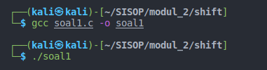
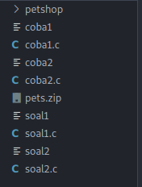
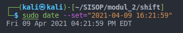
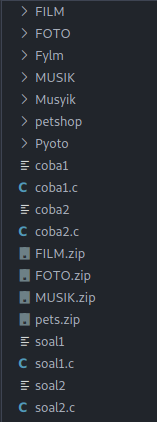
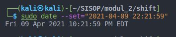
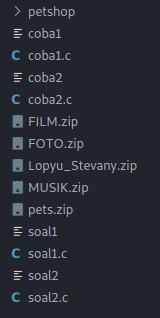
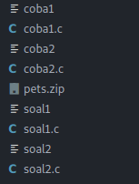
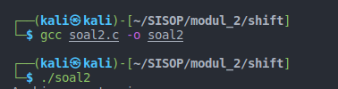
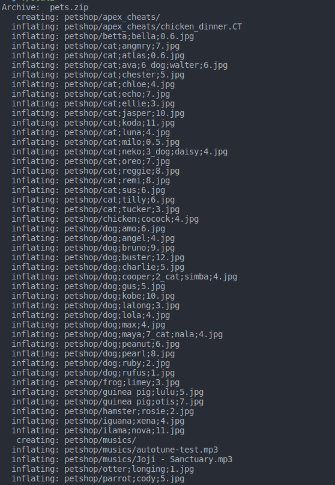
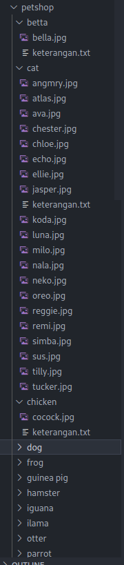

# soal-shift-sisop-modul-2-IT08-2021

# soal1

Pada suatu masa, hiduplah seorang Steven yang hidupnya pas-pasan. Steven punya pacar, namun sudah putus sebelum pacaran. Ketika dia galau memikirkan mantan, ia selalu menonton https://www.youtube.com/watch?v=568DH_9CMKI untuk menghilangkan kesedihannya.

Di lain hal Steven anak yang tidak amat sangat super membenci matkul sisop, beberapa jam setelah diputus oleh pacarnya dia menemukan wanita lain bernama Stevany, namun Stevany berkebalikan dengan Steven karena menyukai sisop. Steven ingin terlihat jago matkul sisop demi menarik perhatian Stevany.

Pada hari ulang tahun Stevany, Steven ingin memberikan Stevany zip berisikan hal-hal yang disukai Stevany. Steven ingin isi zipnya menjadi rapi dengan membuat folder masing-masing sesuai extensi.

- Dikarenakan Stevany sangat menyukai huruf Y, Steven ingin nama folder-foldernya adalah Musyik untuk mp3, Fylm untuk mp4, dan Pyoto untuk jpg
- untuk musik Steven mendownloadnya dari link di bawah, film dari link di bawah lagi, dan foto dari link dibawah juga :).
- Steven tidak ingin isi folder yang dibuatnya berisikan zip, sehingga perlu meng-extract-nya setelah didownload serta
- memindahkannya ke dalam folder yang telah dibuat (hanya file yang dimasukkan).
- Untuk memudahkan Steven, ia ingin semua hal di atas berjalan otomatis 6 jam sebelum waktu ulang tahun Stevany).
- Setelah itu pada waktu ulang tahunnya Stevany, semua folder akan di zip dengan nama Lopyu_Stevany.zip dan semua folder akan di delete(sehingga hanya menyisakan .zip).
  Kemudian Steven meminta bantuanmu yang memang sudah jago sisop untuk membantunya mendapatkan hati Stevany. Bantu Woy!!

## Note

- Ulang Tahun Stevany : 09 April Pukul 22.22 WIB
- Semua poin dijalankan oleh 1 script di latar belakang, termasuk mendownload file zip-nya. Jadi cukup jalankan script 1x serta ubah time dan date untuk check hasilnya.
- Tidak boleh menggunakan fungsi system(), mkdir(), dan rename() (Yang di bahasa C) .... FORBIDDENNN!!
- Tidak boleh pake cron !!!
- Menggunakan fork dan exec.

## Tips

- Gunakan fungsi wait() dan sleep() untuk memperlancarrr..
- untuk mendownload zip yang dibutuhkan bisa menggunakan command :

```bash
wget --no-check-certificate "https://drive.google.com/uc?id=ID-FILE&export=download" -O Nama_untuk_filenya.ext
```

- contoh :

```bash
Wget --no-check-certificate "https://drive.google.com/uc?id=1ZG8nRBRPquhYXq_sISdsVcXx5VdEgi-J&export=download" -O Musik_for_Stevany.zip
```

# Proses Pengerjaan Soal 1

- Pertama, kita deklarasikan kapan Stevany ultah dalam struct tm ultah dengan format (detik, menit, jam, tanggal, bulan, tahun). Lalu variable musik, film, foto untuk pembuatan folder Stevany. variable link untuk menyimpan link download film, musik dan foto. Terakhir variable hasil untuk menyimpan hasil download dengan nama yang diinginkan

```C
struct tm ultah = {0, 22, 22, 9, 3, 121};
    time_t ulangtahun = mktime(&ultah);
    pid_t pid, sid;
    char musik[10] = "Musyik";
    char film[10] = "Fylm";
    char foto[10] = "Pyoto";
    char link_film[150] = "https://drive.google.com/u/0/uc?id=1ktjGgDkL0nNpY-vT7rT7O6ZI47Ke9xcp&export=download";
    char link_musik[200] = "https://drive.google.com/u/0/uc?id=1ZG8nRBRPquhYXq_sISdsVcXx5VdEgi-J&export=download";
    char link_foto[150] = "https://drive.google.com/u/0/uc?id=1FsrAzb9B5ixooGUs0dGiBr-rC7TS9wTD&export=download";
    char hasil1[10] = "MUSIK.zip";
    char hasil2[10] = "FILM.zip";
    char hasil3[10] = "FOTO.zip";
```

- Selanjutnya kita jalankan program daemon dengan menggunakan code yang ada di github SISOP Modul 2

```C
  pid = fork();

  if (pid < 0) {
    exit(EXIT_FAILURE);
  }

  if (pid > 0) {
    exit(EXIT_SUCCESS);
  }

  umask(0);

  sid = setsid();
  if (sid < 0) {
    exit(EXIT_FAILURE);
  }
```

- Setelah itu kita change directory dengan menggunakan fungsi chdir agar penulisan path menjadi lebih rapi

```C
chdir("/home/kali/SISOP/modul_2/shift");
```

- Mode Pertama saat menjalankan program pada waktu 09 April 2021 16:22:00 WIB

```C
while(1){
    time_t now = time(NULL);
    double beda = difftime(ulangtahun, now);
    if(beda > 0 && beda < 21600){
    buat_folder(musik);
    download(link_musik, hasil1);
    extract(hasil1);
    copy("MUSIK/.", musik);

    buat_folder(film);
    download(link_film, hasil2);
    extract(hasil2);
    copy("FILM/.", film);

    buat_folder(foto);
    download(link_foto, hasil3);
    extract(hasil3);
    copy("FOTO/.", foto);
    break;
    }
}
```

- while (1) artinya program akan terus mengecek namun belum dieksekusi karena harus di cek di if nya. jika beda nya 6 jam (21600 detik) dari jam ulang tahun Stevany baru program akan berjalan.

- Mode kedua, saat menjalankan program tepat pada jam ulang tahun Stevany yaitu 09 April 2021 22:22:00 WIB

```C
    while(1){
      time_t now = time(NULL);
      double beda = difftime(ulangtahun, now);
      if(beda < 1 && beda > -1){
        zip(musik, film, foto);
        hapus();
        break;
      }
    }
```

- Program akan mengzip semua folder Musyik, Fylm dan Pyoto serta menghapus semua folder yang ada sehingga hanya menyisakan file .zip

- Fungsi Download dengan menggunakan command wget, setelah didownload file disimpan dengan nama yang isi nya ada di dalam variable tujuan

```C
void download(char *link, char *tujuan){
  pid_t id;
  id = fork();

  if(id == 0){
    //child process
    char *argv[6] = {"wget", "--no-check-certificate", "-q", link, "-O", tujuan};
    execv("/bin/wget", argv);
    exit(EXIT_SUCCESS);
  }else if(id > 0){
    wait(NULL);
  }
}
```

- Fungsi unzip atau extract, meng-extract file yang baru didownload. Dengan perintah "-q" artinya quiet tujuannya agar tidak muncul keterangan file apa saja yang diextract di terminal

```C
void extract(char *tujuan){
  pid_t id;int kondisi;
  id = fork();

  if(id == 0){
    char *argv[4] = {"unzip", "-q", tujuan};
    execv("/usr/bin/unzip", argv);
    exit(EXIT_SUCCESS);
  }else if(id > 0){
    while((wait(&kondisi)) > 0);
  }
}
```

- Fungsi buat folder, untuk membuat folder Musyik, Fylm dan Pyoto

```C
void buat_folder(char *tujuan){
  pid_t id;
  id = fork();
  if(id == 0){
    char *argv[] = {"mkdir", "-p", tujuan, NULL};
    execv("/bin/mkdir", argv);
    exit(EXIT_SUCCESS);
  }else if(id > 0){
    wait(NULL);
  }
}
```

- Fungsi Zip, untuk mengzip beberapa folder yang diinginkan (source 1, source 2 dan source 3)menjadi Lopyu_Stevany.zip

```C
void zip(char *source1, char *source2, char *source3){
  pid_t id; int kondisi;
  id = fork();

  if(id == 0){
    char *argv[8] = {"zip", "-r", "-q", "Lopyu_Stevany.zip", source1, source2, source3};
    execv("/usr/bin/zip", argv);
    exit(EXIT_SUCCESS);
  }else if(id > 0){
    while((wait(&kondisi)) > 0 );
  }
}
```

- Fungsi Copy, sebenarnya untuk memindahkan semua file (tanpa folder) ke folder baru yang bernama Musyik, Fylm dan Pyoto. Menggunakan perintah "-R" artinya recursive untuk mengcopy semua isi dari folder asal ke folder tujuan

```C
void copy(char *asal, char *tujuan){
  pid_t id;
  id = fork();
  if(id == 0){
    char *argv[] = {"cp", "-R", asal, tujuan, NULL};
    execv("/bin/cp", argv);
    exit(EXIT_SUCCESS);
  }else if(id > 0){
    wait(NULL);
  }
}
```

- Fungsi Hapus, untuk menghapus semua folder dengan nama yang diinginkan dengan bantuan "-rf" tujuannya untuk menghapus secara paksa semua isi yang ada di folder tersebut

```C
void hapus(){
  pid_t id;
  id = fork();

  if (id == 0){
    char *argv[8] = {"rm", "-rf", "FOTO", "MUSIK", "FILM", "Musyik", "Fylm", "Pyoto"};
    execv("/bin/rm", argv);
    exit(EXIT_SUCCESS);
  }else if(id > 0){
    wait(NULL);
  }
}
```

- pertama kita compile dan run soal1.c
  <br>
  
- tampilan awal
  <br>
  
- Lalu kita set waktu linux kita ke tanggal 9 April 2021 jam 16:21:59 WIB
  <br>
  
- Program berjalan dan berikut adalah hasil tampilan foldernya
  <br>
  
- Setelah itu kita set waktu linux kita ke tanggal yang sama tapi jam 22:21:59 WIB
  <br>
  
- Program berhasil berjalan dan berikut adalah hasil tampilan terbaru
  <br>
  

# soal2

Loba bekerja di sebuah petshop terkenal, suatu saat dia mendapatkan zip yang berisi banyak sekali foto peliharaan dan Ia diperintahkan untuk mengkategorikan foto-foto peliharaan tersebut. Loba merasa kesusahan melakukan pekerjaanya secara manual, apalagi ada kemungkinan ia akan diperintahkan untuk melakukan hal yang sama. Kamu adalah teman baik Loba dan Ia meminta bantuanmu untuk membantu pekerjaannya.

- Pertama-tama program perlu mengextract zip yang diberikan ke dalam folder “/home/[user]/modul2/petshop”. Karena bos Loba teledor, dalam zip tersebut bisa berisi folder-folder yang tidak penting, maka program harus bisa membedakan file dan folder sehingga dapat memproses file yang seharusnya dikerjakan dan menghapus folder-folder yang tidak dibutuhkan.
- Foto peliharaan perlu dikategorikan sesuai jenis peliharaan, maka kamu harus membuat folder untuk setiap jenis peliharaan yang ada dalam zip. Karena kamu tidak mungkin memeriksa satu-persatu, maka program harus membuatkan folder-folder yang dibutuhkan sesuai dengan isi zip.
  Contoh: Jenis peliharaan kucing akan disimpan dalam “/petshop/cat”, jenis peliharaan kura-kura akan disimpan dalam “/petshop/turtle”.
- Setelah folder kategori berhasil dibuat, programmu akan memindahkan foto ke folder dengan kategori yang sesuai dan di rename dengan nama peliharaan.
  Contoh: “/petshop/cat/joni.jpg”.
- Karena dalam satu foto bisa terdapat lebih dari satu peliharaan maka foto harus di pindah ke masing-masing kategori yang sesuai. Contoh: foto dengan nama “dog;baro;1_cat;joni;2.jpg” dipindah ke folder “/petshop/cat/joni.jpg” dan “/petshop/dog/baro.jpg”.
- Di setiap folder buatlah sebuah file "keterangan.txt" yang berisi nama dan umur semua peliharaan dalam folder tersebut. Format harus sesuai contoh.

```C
nama : joni
umur  : 3 tahun

nama : miko
umur  : 2 tahun
```

Loba sangat mengapresiasi bantuanmu, minggu depan ia akan mentraktir makan malam!

## Note

- Setiap data peliharaan disimpan sebagai nama foto dengan format [jenis peliharaan]:[nama peliharaan]:[umur peliharaan dalam tahun]. Jika terdapat lebih dari satu peliharaan, data dipisahkan menggunakan underscore(\_).
- Tidak boleh menggunakan fungsi system(), mkdir(), dan rename().
- Menggunakan fork dan exec.

# Proses Pengerjaan Soal 2

- Fungsi int main, pertama kita deklarasikan nama zip yang akan diproses dan tujuan folder yang akan dibuat. chdir untuk mengubah current working directorynya, lalu terdapat struct dirent dengan nama variable cek dan tipe DIR dengan nama yaitu "folder" dan membuka isi dari folder tujuan yaitu folder petshop. Lalu di cek apakah folder tersebut ada atau tidak, jika ada maka akan dilanjutkan ke proses selanjutnya. jika tidak maka program akan selesai.

- Lalu terdapat while loop untuk mengecek setiap file yang ada di folder petshop. Jika nama file tersebut valid maka akan dilanjutkan ke proses selanjutnya.

```C
int main(){
    char source[10] = "pets.zip";
    char tujuan[10] = "petshop";

    chdir("/home/kali/SISOP/modul_2/shift");
    extract(source, tujuan);

    struct dirent *cek;
    DIR *folder = opendir(tujuan);

    if(!folder){
        exit(EXIT_FAILURE);
    }

    chdir("petshop");

    while (cek = readdir(folder)){
        //mengecek apakah nama filenya valid
        if(strcmp(cek->d_name, ".") != 0 && strcmp(cek->d_name, "..") != 0){
            check(cek->d_name);
        }
    }
    return 0;
}
```

- Fungsi extract/unzip untuk meng-extract pets.zip ke folder petshop

```C
void extract(char *asal, char *tujuan){
    pid_t id_1; int kondisi;
    id_1 = fork();

    //mengunzip pets.zip ke folder petshop(tujuan)
    if(id_1 == 0){
        char *argv[5] = {"unzip", asal, "-d", tujuan};
        execv("/usr/bin/unzip", argv);
        exit(EXIT_SUCCESS);
    }else if(id_1 > 0){
        while(wait(&kondisi) > 0);
    }
}
```

- Fungsi hapus, untuk menghapus folder yang tidak penting beserta isinya

```C
void hapus(char *nama){
    char tujuan[20];
    sprintf(tujuan, "%s/", nama);

    pid_t id_2; int kondisi;
    id_2 = fork();

    if(id_2 == 0){
        //menghapus folder yang tidak penting
        char *argv[4] = {"rm", "-rf", tujuan};
        execv("/bin/rm", argv);
        exit(EXIT_SUCCESS);
    }else if(id_2 > 0){
        while(wait(&kondisi) > 0);
    }
}
```

- Fungsi buat_folder, untuk membuat folder berdasarkan jenis hewan

```C
void buat_folder(char *nama){
    char tujuan[40];
    sprintf(tujuan, "%s", nama);
    pid_t id_3; int kondisi;

    DIR *folder = opendir(nama);
    if(folder){
        return;
    }

    id_3 = fork();

    if(id_3 == 0){
        //membuat folder baru berdasarkan jenis hewan
        char *argv[3] = {"mkdir", tujuan};
        execv("/bin/mkdir", argv);
        exit(EXIT_SUCCESS);
    }else if(id_3 > 0){
        while(wait(&kondisi) > 0);
    }
}
```

- Fungsi copy, untuk mengcopy file ke folder sesuai dengan jenis hewan nya

```C
void copy(char *folder, char *asal, char *tujuan){
    char source[30];int kondisi;
    sprintf(source, "%s", asal);

    char destination[40];
    sprintf(destination, "%s/%s.jpg", folder, tujuan);

    pid_t id_4;
    id_4 = fork();
    //mengcopy file ke folder sesuai jenis hewan nya
    if(id_4 == 0){
        char *argv[4] = {"cp", source, destination};
        execv("/bin/cp", argv);
        exit(EXIT_SUCCESS);
    }else if(id_4 > 0){
        while(wait(&kondisi) > 0);
    }
}
```

- Fungsi keterangan, untuk memberi keterangan di setiap folder mengenai nama hewan dan umur hewan yang ada di folder tersebut. Menulis file dapat menggunakan bantuan fopen dan fprintf lalu di close dengan fclose

```C
void keterangan (char *folder, char *nama_hewan, char *umur_hewan){
    char keterangan[50];
    sprintf(keterangan, "%s/keterangan.txt", folder);

    pid_t id_5;int kondisi;
    id_5 = fork();

    if(id_5 == 0){
        FILE *tulis;
        tulis = fopen(keterangan, "a");
        fprintf(tulis, "nama: %s\numur: %s\n\n", nama_hewan, umur_hewan);
        fclose(tulis);
        exit(EXIT_SUCCESS);
    }else if(id_5 > 0){
        while(wait(&kondisi) > 0);
    }
}
```

- Fungsi Cek, untuk mengecek apakah file tersebut penting atau tidak, jika tidak maka akan dihapus. Untuk mendapatkan jenis hewan, nama hewan dan umur hewan, kita menggunakan fungsi dari library.h yaitu strtok. Lalu menyimpan hasil nya ke dalam array ke jenis_nama_umur. array ke [0] untuk jenis hewan, [1] untuk nama hewan dan [2] untuk umur hewan. Namun hasil dari umur hewan belum benar 100% karena terdapat ".jpg" oleh karena itu kita menggunakan fungsi dari strstr yaitu mencari string dari string lainnya. Lalu hasilnya akan dikurangi dengan umur hewan.

- Lalu kita buat folder sesuai dengan jenis hewan, mengcopy file ke folder sesuai dengan jenis hewan, dan memberi keterangan berisi nama dan umur hewan di setiap folder. Setelah while loop selesai maka harus closedir untuk menutup folder.

```C
void check(char *source){
    char *nama_asal[40];
    sprintf(nama_asal, "%s", source);

    DIR *folder = opendir(source);

    //menghapus folder yang tidak penting
    if(folder){
        hapus(nama_asal);
    }else{
        char *token, *jenis_nama_umur[3];
        token = strtok(source, ";_");
        //fungsi perulangan jika terdapat lebih dari 1 hewan berdasarkan nama filenya
        while(token != NULL){
            //mendapatkan jenis, nama, umur hewan dengan fungsi strtok
            int i = 0;
            while(i<3){
                jenis_nama_umur[i] = token;
                token = strtok(NULL, ";_");
                i++;
            }

            char *nama_folder = jenis_nama_umur[0];
            char *nama_hewan = jenis_nama_umur[1];
            char *umur_hewan = jenis_nama_umur[2];

            char *jpg;
            jpg = strstr(umur_hewan, ".jpg");
            if(jpg != NULL){
                int counter = jpg - umur_hewan;
                sprintf(umur_hewan, "%.*s", counter, umur_hewan);
            }

            buat_folder(nama_folder);
            copy(nama_folder, nama_asal, nama_hewan);
            keterangan(nama_folder, nama_hewan, umur_hewan);
        }
    }
    closedir(folder);
}
```

- Tampilan awal list folder
  <br>
  

- Compile dan Run program soal2.c
  <br>
  

- hasil extract dari pets.zip ke folder petshop. Sekaligus membuat folder sesuai dengan jenis hewan yang ada
  <br>
  

- Tampilan list folder dari petshop
  <br>
  

- Isi dari keterangan.txt dari folder petshop/cat

```C
nama: oreo
umur: 7

nama: angmry
umur: 7

nama: jasper
umur: 10

nama: tilly
umur: 6

nama: simba
umur: 4

nama: atlas
umur: 0.6

nama: nala
umur: 4

nama: reggie
umur: 8

nama: luna
umur: 4

nama: remi
umur: 8

nama: ellie
umur: 3

nama: tucker
umur: 3

nama: koda
umur: 11

nama: sus
umur: 6

nama: chester
umur: 5

nama: milo
umur: 0.5

nama: echo
umur: 7

nama: chloe
umur: 4

nama: neko
umur: 3

nama: ava
umur: 6
```

# soal3

Ranora adalah mahasiswa Teknik Informatika yang saat ini sedang menjalani magang di perusahan ternama yang bernama “FakeKos Corp.”, perusahaan yang bergerak dibidang keamanan data. Karena Ranora masih magang, maka beban tugasnya tidak sebesar beban tugas pekerja tetap perusahaan. Di hari pertama Ranora bekerja, pembimbing magang Ranora memberi tugas pertamanya untuk membuat sebuah program.

- Ranora harus membuat sebuah program C yang dimana setiap 40 detik membuat sebuah direktori dengan nama sesuai timestamp [YYYY-mm-dd_HH:ii:ss].
  Setiap direktori yang sudah dibuat diisi dengan 10 gambar yang didownload dari https://picsum.photos/, dimana setiap gambar akan didownload setiap 5 detik. Setiap gambar yang didownload akan diberi nama dengan format timestamp [YYYY-mm-dd_HH:ii:ss] dan gambar tersebut berbentuk persegi dengan ukuran (n%1000) + 50 pixel dimana n adalah detik Epoch Unix.
- Setelah direktori telah terisi dengan 10 gambar, program tersebut akan membuat sebuah file “status.txt”, dimana didalamnya berisi pesan “Download Success” yang terenkripsi dengan teknik Caesar Cipher dan dengan shift 5. Caesar Cipher adalah Teknik enkripsi sederhana yang dimana dapat melakukan enkripsi string sesuai dengan shift/key yang kita tentukan. Misal huruf “A” akan dienkripsi dengan shift 4 maka akan menjadi “E”. Karena Ranora orangnya perfeksionis dan rapi, dia ingin setelah file tersebut dibuat, direktori akan di zip dan direktori akan didelete, sehingga menyisakan hanya file zip saja.
- Untuk mempermudah pengendalian program, pembimbing magang Ranora ingin program tersebut akan men-generate sebuah program “Killer” yang executable, dimana program tersebut akan menterminasi semua proses program yang sedang berjalan dan akan menghapus dirinya sendiri setelah program dijalankan. Karena Ranora menyukai sesuatu hal yang baru, maka Ranora memiliki ide untuk program “Killer” yang dibuat nantinya harus merupakan program bash.
- Pembimbing magang Ranora juga ingin nantinya program utama yang dibuat Ranora dapat dijalankan di dalam dua mode. Untuk mengaktifkan mode pertama, program harus dijalankan dengan argumen -z, dan Ketika dijalankan dalam mode pertama, program utama akan langsung menghentikan semua operasinya Ketika program Killer dijalankan. Sedangkan untuk mengaktifkan mode kedua, program harus dijalankan dengan argumen -x, dan Ketika dijalankan dalam mode kedua, program utama akan berhenti namun membiarkan proses di setiap direktori yang masih berjalan hingga selesai (Direktori yang sudah dibuat akan mendownload gambar sampai selesai dan membuat file txt, lalu zip dan delete direktori).

## Note

- Tidak boleh menggunakan system() dan mkdir()
- Program utama merupakan SEBUAH PROGRAM C
- Wajib memuat algoritma Caesar Cipher pada program utama yang dibuat
